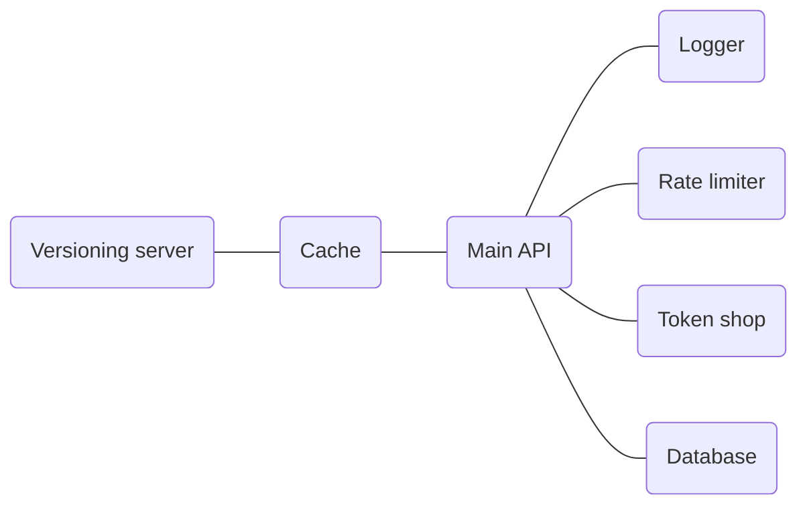

# System architecture

```mermaid
graph LR

id6(Versioning server) --- id2(Cache)
id2(Cache) --- id1(Main API)
id1(Main API) --- id3(Logger)
id1(Main API) --- id4(Rate limiter)
id1(Main API) --- id5(Token shop)
id1(Main API) --- id7(Database)
```
